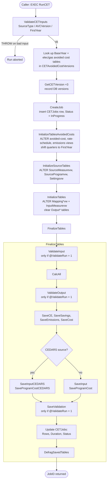
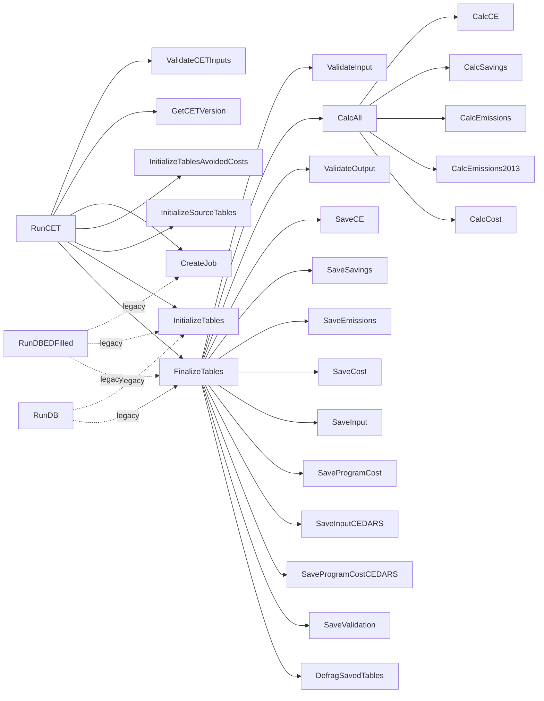
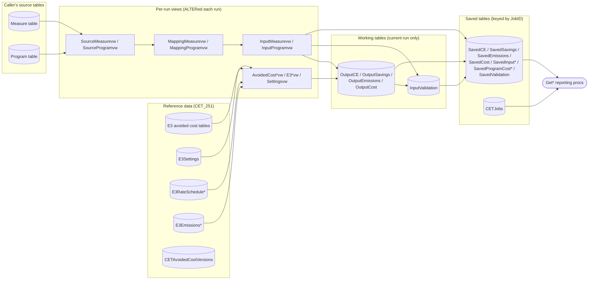

# CET v25.1 stored procedures

This folder holds the 58 T‑SQL stored procedures exported from the CPUC Cost Effectiveness Tool (CET) database `CET_251`. Together they take measure and program claim data, calculate cost effectiveness (TRC, PAC, RIM, SCT), energy savings, emissions, and costs, and store the results by job.

This README covers:

- how a CET run works end to end
- how the procedures call each other
- how to execute each procedure and what parameters it expects
- known issues found while reading the code

> **File encoding.** The `.sql` files are UTF‑16 LE with CRLF line endings (the SSMS "Script As" default), so `grep` and `diff` won't read them directly. Convert first, for example:
> `iconv -f UTF-16 -t UTF-8 dbo.RunCET.StoredProcedure.sql | tr -d '\r'`

---

## Contents

1. [Quick start](#quick-start)
2. [How the tool works (end‑to‑end flow)](#how-the-tool-works-end-to-end-flow)
3. [Call graph](#call-graph)
4. [Data layers](#data-layers)
5. [Procedure reference](#procedure-reference)
   - [Entry points](#1-entry-points)
   - [Setup and initialization](#2-setup-and-initialization)
   - [Validation](#3-validation)
   - [Calculation engine](#4-calculation-engine)
   - [Persisting results](#5-persisting-results)
   - [Reporting and retrieval](#6-reporting-and-retrieval)
   - [Job management](#7-job-management)
   - [Version lookup](#8-version-lookup)
   - [Maintenance and reset](#9-maintenance-and-reset)
6. [Known issues and caveats](#known-issues-and-caveats)

---

## Quick start

`dbo.RunCET` is the only supported entry point for a calculation run. Everything else runs from it or reads its results afterwards.

```sql
USE CET_251;

EXEC dbo.RunCET
     @MeasureTable            = N'MySourceDb.dbo.InputMeasure'  -- or just N'InputMeasure' with @CETSourceDbName
    ,@ProgramTable            = N'InputProgram'
    ,@SourceType              = N'CETDatabase'                  -- see "Source types" below
    ,@AVCVersion              = N'2024'                         -- must exist in dbo.CETAvoidedCostVersions
    ,@FirstYear               = 2025                            -- omit to use the avoided cost version's BaseYear
    ,@MEBens                  = 0.0                             -- market effects benefits adder
    ,@MECost                  = 0.0                             -- market effects cost adder
    ,@Description             = N'PY2025 Q1 claims'
    ,@CETDataDbName           = N''                             -- '' = save results in CET_251 itself
    ,@IncludeNonresourceCosts = 0;
-- Returns the new JobID (result set and RETURN value).
```

Then read the results back by JobID:

```sql
DECLARE @JobID int = 123;

EXEC dbo.GetJobAllByJobID           @JobID;   -- portfolio (PA) level totals
EXEC dbo.GetProgramsAllByJobID      @JobID;   -- program level results
EXEC dbo.GetMeasuresAllByJobID      @JobID;   -- claim/measure level results
EXEC dbo.GetValidationSummaryByJobID @JobID;  -- warnings and errors

SELECT Status, StatusDetail, Rows, Duration FROM dbo.CETJobs WHERE ID = @JobID;
```

### Source types

`@SourceType` controls input mapping and how inputs are saved. `ValidateCETInputs` accepts only these values:

| Value | Input mapping | Saved input format |
|---|---|---|
| `CETDatabase` (default) | Existing `MappingMeasurevw` / `MappingProgramvw` definitions | `SavedInput`, `SavedProgramCost` |
| `CETInput` | Same as above | Same as above |
| `EDFilledDatabase` | Same as above | Same as above |
| `Excel` | Same as above, and sets `InputMeasure.JobID` to the new job | Same as above |
| `CEDARS`, `CEDARSDatabase`, `CEDARSExcel` | `InitializeTables` regenerates `MappingMeasurevw` / `MappingProgramvw` to translate CEDARS column names to CET names | `SavedInputCEDARS`, `SavedProgramCostCEDARS` |

---

## How the tool works (end‑to‑end flow)



### Step by step

1. **Validate run parameters.** `ValidateCETInputs` raises an error (`THROW 5000x`) if the source type is unknown, the avoided cost version isn't in `CETAvoidedCostVersions` (or is `2013`), or `@FirstYear` is outside 2013–2040.
2. **Resolve the avoided cost version.** `RunCET` reads `BaseYear`, `AVCElecTable`, and `AVCGasTable` from `dbo.CETAvoidedCostVersions`. If `@FirstYear` is `-1` (not passed), it uses `BaseYear`.
3. **Create the job.** `CreateJob` inserts a row in `CETJobs` (in `@CETDataDbName` if one is given) and returns the new ID through `@JobIDOut`. The JobID tags every saved row.
4. **Point the views at this run's data.** The engine uses views as its "parameters", and three procs regenerate them with `ALTER VIEW` on every run:
   - `InitializeTablesAvoidedCosts` → `AvoidedCostSourceElecvw`, `AvoidedCostSourceGasvw`, `E3RateScheduleSourceElecvw`, `E3RateScheduleSourceGasvw`, `E3EmissionsSourcevw`. When `FirstYear > BaseYear`, it shifts quarter index `Qac` by `(FirstYear − BaseYear) × 4` so quarter 1 is the first program year.
   - `InitializeSourceTables` → `SourceMeasurevw` / `SourceProgramvw` (a `SELECT *` over the caller's tables) and `Settingsvw` (discount rates etc. from `E3Settings` for the AVC version).
   - `InitializeTables` → `MappingMeasurevw` / `MappingProgramvw` (CEDARS only) and `InputMeasurevw`, which applies defaults (NTG, IR, and RR default to 1), derives `Qm`/`Qy` from `ClaimYearQuarter` and `FirstYear`, computes EUL/RUL quarters, and builds the `ACElecKey` and `ACGasKey` join keys. It then clears `OutputCE`, `OutputSavings`, `OutputEmissions`, and `OutputCost`.
5. **Calculate.** `FinalizeTables` calls `CalcAll`, which runs:
   - `CalcCE`: present-value benefits (elec, gas, water-energy, other; net and gross; base, SB, and SH societal cases), supply costs, TRC/PAC/RIM/SC costs, and ratios → `OutputCE`
   - `CalcSavings`: annual, lifecycle, and first-year gross and net savings, plus the weighted savings used to allocate program costs → `OutputSavings`
   - `CalcEmissions`: quarterly CO2, NOx, and PM10 through EUL, with dual-baseline handling → `OutputEmissions`. `CalcEmissions2013` replaces it when `@AVCVersion = '2013'`.
   - `CalcCost`: measure and program costs, NPV, discounted savings, and levelized cost → `OutputCost`

   If the job's `CETJobs.SavingsOnly = 1`, only `CalcSavings` runs.
6. **Validate.** `ValidateInput` (before calculation) and `ValidateOutput` (after) write warnings and errors to `InputValidation`. This only happens when `@ValidateRun = 1`; see the [known issues](#known-issues-and-caveats).
7. **Persist.** The `Save*` procs copy the working `Output*` tables and input views into the JobID-keyed `Saved*` tables in `@CETDataDbName`, or in the core DB if that's blank.
8. **Close out.** `FinalizeTables` sets `CETJobs.Rows`, `Started`, `Finished`, `Duration`, and `Status`:
   - `Completed`: no validation rows
   - `Completed with Warnings`: at least one validation row
   - `Failed`: `CalcAll` returned non-zero

   It then rebuilds any fragmented indexes on the Output and Saved tables.
9. **Read results.** A UI or analyst calls the `Get*` procs with the JobID.

---

## Call graph

Arrows mean "executes". Procs with no incoming arrow are called directly by a user or the CET web application.



**Standalone procs** (not called by any other proc in this folder):

- Reporting: `GetJobAllByJobID`, `GetProgramsAllByJobID`, `GetPrograms`, `GetMeasuresAllByJobID`, `GetMeasuresAllByJobIDPaged`, `GetMeasureInputsAllByJobID`, `GetMeasureInputsCEDARSAllByJobID`, `GetProgramInputsAllByJobID`, `GetProgramInputsCEDARSAllByJobID`, `GetResultRowCount`
- Validation read-back: `GetValidationsByJobID`, `GetValidationsAllByJobID`, `GetValidationsAllByJobIDPaged`, `GetValidationsAllByMessageType`, `GetValidationSummaryByJobID`, `GetValidationCount`, `ValidationSummary`
- Job admin: `GetJobsByUser`, `GetJobStatusByUser`, `GetJobProcessTime`, `RenameJob`, `DeleteJob`, `MergeJobs`
- Versions: `GetAvoidedCostVersion`, `GetCETVersionDBName`, `SaveCETVersionDBName`
- Maintenance: `ClearAllCETTables`, `ClearRefreshAllTablesIncludingSaved`
- Unused: `CalcEmissions2017T` (nothing calls it)

---

## Data layers



Because the views and `Output*` tables are shared state, **only one job can run in a given core database at a time**. A second concurrent `RunCET` would re-point the views mid-run.

---

## Procedure reference

In the parameter tables, **Req.** means there is no default and the caller must pass a value. `OUT` marks an output parameter.

### 1. Entry points

#### `RunCET`

Main entry point. Validates inputs, creates a job, initializes the views, runs the calculations, and saves the results. Prints progress messages and returns the new JobID, both as a one-row result set and as the procedure's `RETURN` value.

| Parameter | Type | Default | Notes |
|---|---|---|---|
| `@MeasureTable` | varchar(255) | `'EDFilled'` | Measure/claim table. Either `Table` or `Db.dbo.Table`. The legacy `Db.dbo.` prefix sets the source DB when `@CETSourceDbName` is blank. |
| `@ProgramTable` | varchar(255) | `'ProgramCost'` | Program cost table in the source DB. |
| `@MEBens` | float | `0.0` | Market effects benefits adder. |
| `@MECost` | float | `0.0` | Market effects cost adder. |
| `@Description` | nvarchar(255) | `''` | Job description. Blank becomes `'RunDB job started at <now>'`. |
| `@CETSourceDbName` | nvarchar(255) | `''` | Database holding the source tables. Blank means the current DB. |
| `@CETDataDbName` | nvarchar(255) | `''` | Database where `CETJobs` and `Saved*` rows go. Blank means the current DB. |
| `@SourceType` | nvarchar(25) | `'CETDatabase'` | See [Source types](#source-types). |
| `@FilePath` | nvarchar(500) | `''` | Stored on the job as `InputFilePathMeasure` (informational). |
| `@User` | nvarchar(255) | `''` | Blank means `SYSTEM_USER`. |
| `@AVCDbName` | nvarchar(255) | `''` | Avoided cost DB recorded on the job. Blank means the current DB. |
| `@AVCVersion` | nvarchar(255) | `''` | **Effectively required.** Must match `CETAvoidedCostVersions.Version`, otherwise validation throws. |
| `@FirstYear` | int | `-1` | First program year, 2013–2040. `-1` uses the AVC version's `BaseYear`. |
| `@IncludeNonresourceCosts` | bit | `0` | Passed through to the initializers. Not used by any logic in v25.1. |

#### `RunDB` / `RunDBEDFilled` (legacy, superseded by `RunCET`)

Their headers mark both as superseded and kept for legacy purposes. **Neither runs against the v25.1 signatures** (see [known issues](#known-issues-and-caveats)).

| Proc | Parameters |
|---|---|
| `RunDB` | `@MeasureTable varchar(255)='EDFilled'`, `@ProgramTable varchar(255)='ProgramCost'`, `@MEBens float=0.0`, `@MECost float=0.0`, `@Description nvarchar(255)=''` |
| `RunDBEDFilled` | Same as `RunDB`, plus `@CETDataDbName nvarchar(255)=''` |

### 2. Setup and initialization

These are called by `RunCET`. You would only call them directly when debugging a single stage.

#### `CreateJob`

Inserts a `CETJobs` row (in `@CETDataDbName` when given) and returns its ID.

```sql
DECLARE @JobID int;
EXEC dbo.CreateJob @JobDescription = N'test', @SourceType = N'CETDatabase',
     @AvoidedCostVersion = N'2024', @FirstYear = 2025, @Status = N'InProgress',
     @JobIDOut = @JobID OUTPUT;
```

| Parameter | Type | Default |
|---|---|---|
| `@CETDataDbName` | nvarchar(128) | `N''` |
| `@WebUserId`, `@UserID`, `@Password` | nvarchar(256/255) | `N''` |
| `@JobDescription` | nvarchar(255) | `N''` |
| `@SourceType` | nvarchar(50) | `N''` (also written to `MappingType`) |
| `@Server` | nvarchar(255) | `N''` |
| `@CETSourceDbName` | nvarchar(128) | `N''` (stored as `Database`) |
| `@InputProgramTable`, `@InputMeasureTable` | nvarchar(255) | `N''` |
| `@InputFilePathMeasure`, `@InputFilePathProgram` | nvarchar(298) | `N''` |
| `@CETCoreDbName` | nvarchar(128) | `N''` |
| `@Version`, `@CETSourceVersion`, `@CETCoreVersion`, `@CETDataVersion` | nvarchar(255) | `N''` |
| `@Status` | nvarchar(255) | `N''` |
| `@StatusDetail` | nvarchar(max) | `N''` |
| `@MarketEffectBens`, `@MarketEffectCost` | float | `NULL` (stored as 0) |
| `@SavingsOnly` | bit | `0`. When 1, `CalcAll` runs only `CalcSavings`. |
| `@AvoidedCostDbName` | nvarchar(255) | `N''` |
| `@AvoidedCostVersion` | nvarchar(255) | `N'2013'` |
| `@FirstYear` | int | `2013` |
| `@JobIDOut` | int OUT | `-1` |

#### `InitializeTablesAvoidedCosts`

Re-points the avoided cost, rate schedule, and emissions views to the selected AVC version and shifts quarters to `@FirstYear`. On error, it writes the message to `CETJobs.StatusDetail` and re-raises it.

`EXEC dbo.InitializeTablesAvoidedCosts @JobID, @AvoidedCostElecTable, @AvoidedCostGasTable, @BaseYear, @FirstYear, @AVCVersion`

| Parameter | Type | Default |
|---|---|---|
| `@JobID` | int | `-1` |
| `@AvoidedCostElecTable` | nvarchar(255) | Req. (from `CETAvoidedCostVersions.AVCElecTable`) |
| `@AvoidedCostGasTable` | nvarchar(255) | Req. (from `CETAvoidedCostVersions.AVCGasTable`) |
| `@BaseYear` | int | `2013` |
| `@FirstYear` | int | `2013` |
| `@AVCVersion` | nvarchar(255) | Req. |

#### `InitializeSourceTables`

Re-points `SourceMeasurevw` and `SourceProgramvw` to `@SourceDatabase.dbo.<table>`, and `Settingsvw` to `E3Settings` for `@AVCVersion`.

`EXEC dbo.InitializeSourceTables @jobId, @SourceType, @SourceDatabase, @MeasureTable, @ProgramTable, @FirstYear, @AVCVersion, @IncludeNonresourceCosts`

| Parameter | Type | Default |
|---|---|---|
| `@jobId` | int | Req. |
| `@SourceType` | nvarchar(25) | Req. |
| `@SourceDatabase` | nvarchar(255) | Req. |
| `@MeasureTable`, `@ProgramTable` | nvarchar(255) | Req. (bare table names) |
| `@FirstYear` | int | `2013` |
| `@AVCVersion` | nvarchar(255) | Req. |
| `@IncludeNonresourceCosts` | bit | `0` (unused) |

#### `InitializeTables`

Same parameters as `InitializeSourceTables`, except `@JobID` defaults to `-1`. It:

- detects whether `SourceMeasurevw` has `CombustionType` and `MeasInflation` columns
- for CEDARS sources, regenerates `MappingMeasurevw` and `MappingProgramvw`
- regenerates `InputMeasurevw`, which is where defaults, quarter indexes (`Qm`, `Qy`), EUL/RUL quarters, and avoided cost keys are computed
- clears the four `Output*` tables

### 3. Validation

| Proc | Parameters | What it does |
|---|---|---|
| `ValidateCETInputs` | `@SourceType nvarchar(25)='CETDatabase'`, `@AVCVersion nvarchar(255)='2013'`, `@FirstYear int` (Req.) | Checks the run parameters. Throws 50001 (bad source type), 50003 (FirstYear out of range), or 50004 (unknown AVC version, or 2013). |
| `ValidateInput` | `@JobID int=-1`, `@AVCVersion varchar(255)='2013'`, `@FirstYear int=2013` | Row-level input checks written to `InputValidation`. **Errors:** null PA, CET_ID, or Qty; duplicate CET_ID; claim before FirstYear; blank program ClaimYearQuarter. **Warnings:** no matching elec/gas avoided cost; negative participant cost; RUL ≥ EUL; RUL > EUL/3; RUL = 0 with 2nd baseline values; RUL > 0 without 2nd baseline UES; EUL longer than the AVC table; missing `Q` in ClaimYearQuarter; PrgID with no program row. |
| `ValidateOutput` | `@JobID int=-1` | Output sanity checks written to `InputValidation`: savings without benefits or emissions, claim TRC more than 3σ from the mean, TRC < 0.1. |
| `ValidationSummary` | none | Counts of `InputValidation` rows by table, error type, and message (current run only). |

### 4. Calculation engine

Each proc reads `InputMeasurevw`, `InputProgramvw`, the avoided cost views, and `Settingsvw`. Each one builds its results in a `#temp` table and then replaces the contents of its `Output*` table. When `@MEBens` or `@MECost` is `NULL`, the value is read from `CETJobs`.

| Proc | Parameters | Output table | What it computes |
|---|---|---|---|
| `CalcAll` | `@JobID int=-1`, `@MEBens float=NULL`, `@MECost float=NULL`, `@AVCVersion varchar(255)` (Req.), `@FirstYear int` (Req.) | — | Runs the four procs below in order: CE, Savings, Emissions, Cost. |
| `CalcCE` | `@JobID int=-1`, `@MEBens float=NULL`, `@MECost float=NULL`, `@FirstYear int=2013`, `@AVCVersion varchar(255)` (Req.) | `OutputCE` | PV elec, gas, water-energy, and other benefits (net and gross; base, SB, and SH societal); supply costs for fuel substitution; TRC, PAC, and SC costs with program costs allocated by weighted benefits; RIM costs and bill reductions; TRC, PAC, SCT, and RIM ratios. |
| `CalcSavings` | `@JobID int=-1`, `@MEBens float=NULL` | `OutputSavings` | Annual, lifecycle, and first-year gross and net kWh (site and water), kW, and therms, plus `WeightedSavings`. |
| `CalcEmissions` | `@JobID int=-1`, `@MEBens float=NULL`, `@AVCVersion varchar(255)` (Req.) | `OutputEmissions` | Quarterly CO2, NOx, and PM10 through EUL, with single or dual baseline handling. Used for every AVC version except 2013. |
| `CalcEmissions2013` | `@JobID int=-1`, `@MEBens float=NULL` | `OutputEmissions` | Legacy emissions logic for 2013 avoided costs. |
| `CalcEmissions2017T` | `@JobID int=-1`, `@MEBens float=NULL` | `OutputEmissions` | Variant using `E3EmissionsSource2017Tvw`. **Not called anywhere.** |
| `CalcCost` | `@JobID int=-1`, `@MEBens float=NULL`, `@MECost float=NULL`, `@FirstYear int` (Req.), `@AVCVersion varchar(255)` (Req.) | `OutputCost` | Measure and program costs, participant cost, rebates and incentives, NPV fields, discounted savings, and levelized cost ($/kWh, $/kW, $/therm). |

Running one stage by hand, after `InitializeTables` has set up the views for the job:

```sql
EXEC dbo.CalcAll @JobID = 123, @MEBens = NULL, @MECost = NULL, @AVCVersion = N'2024', @FirstYear = 2025;
```

#### `FinalizeTables`

The orchestrator for validation, calculation, saving, and the job status update.

| Parameter | Type | Default | Notes |
|---|---|---|---|
| `@JobID` | int | `-1` | |
| `@MEBens`, `@MECost` | float | `NULL` | |
| `@CETDataDbName` | nvarchar(255) | `''` | Target DB for saved results. |
| `@ValidateRun` | bit | `1` | `1` runs `ValidateInput`, `ValidateOutput`, and `SaveValidation`. `0` skips them. |
| `@AVCVersion` | varchar(255) | Req. | |
| `@FirstYear` | int | Req. | |
| `@SourceType` | varchar(255) | `''` | CEDARS types select the CEDARS save procs. |

### 5. Persisting results

All of these take `@JobID int = -1` and `@CETDataDbName varchar(255) = ''` (blank means the current DB). Each deletes the job's existing rows in the target table, then inserts the current run's rows tagged with `@JobID`.

| Proc | Extra params | Source → Target |
|---|---|---|
| `SaveCE` | — | `OutputCE` → `SavedCE` |
| `SaveSavings` | — | `OutputSavings` → `SavedSavings` |
| `SaveEmissions` | — | `OutputEmissions` → `SavedEmissions` |
| `SaveCost` | — | `OutputCost` → `SavedCost` |
| `SaveInput` | `@MEBens float` (Req.), `@MECost float` (Req.) | `InputMeasurevw` → `SavedInput` |
| `SaveInputCEDARS` | `@MEBens float` (Req.), `@MECost float` (Req.) | `SourceMeasurevw` → `SavedInputCEDARS` |
| `SaveProgramCost` | — | `InputProgramvw` → `SavedProgramCost` |
| `SaveProgramCostCEDARS` | — | `SourceProgramvw` → `SavedProgramCostCEDARS` |
| `SaveValidation` | — | Copies the core DB's `SavedValidation` rows to `@CETDataDbName.dbo.SavedValidation`, then deletes the core copies. Does nothing when `@CETDataDbName` is blank or the current DB. |

### 6. Reporting and retrieval

All of these read from the `Saved*` tables and `CETJobs` in the **current** database. `@JobID` is required unless noted.

| Proc | Parameters | Returns |
|---|---|---|
| `GetJobAllByJobID` | `@JobID int` | Portfolio totals by PA: benefits, costs, ratios, savings, emissions, and levelized costs. |
| `GetProgramsAllByJobID` | `@JobID int` | The same metrics grouped by PA and program. Uses the CEDARS or CET input tables based on the job's `SourceType`. |
| `GetPrograms` | `@JobID int`, `@PAString nvarchar(100)=NULL`, `@GroupByClause nvarchar(50)` (Req.), `@SearchString nvarchar(100)` (Req.) | Benefit/cost summary. `@GroupByClause = 'Programs'` (or NULL) groups by PA and PrgID. Any other value groups by job across **all** jobs whose description matches. `@PAString` is a comma-separated PA filter. Pass `@SearchString = ''` to match everything, because NULL matches nothing. |
| `GetMeasuresAllByJobID` | `@JobID int` | Claim-level results joining CE, savings, emissions, cost, and input. Branches on CEDARS source types. |
| `GetMeasuresAllByJobIDPaged` | `@JobID int`, `@StartRow int=0`, `@NumRows int=250` | Paged version of the above. |
| `GetMeasureInputsAllByJobID` | `@JobID int` | The saved CET-format measure inputs for the job. |
| `GetMeasureInputsCEDARSAllByJobID` | `@JobID int` | The saved measure inputs in CEDARS format when the job's source was CEDARS, otherwise CET format. |
| `GetProgramInputsAllByJobID` | `@JobID int` | Saved program cost inputs. |
| `GetProgramInputsCEDARSAllByJobID` | `@JobID int` | Saved program cost inputs, CEDARS or CET format depending on the job. |
| `GetResultRowCount` | `@JobID int`, `@Count int OUT` | Number of `SavedCE` rows for the job. |
| `GetValidationsByJobID` | `@JobID int` | Message type, message text, and count. |
| `GetValidationSummaryByJobID` | `@JobID int` | Counts by table, error type, and message type. |
| `GetValidationsAllByJobID` | `@JobID int` | Every validation row joined to its claim keys (PA, PrgID, TS, EU, CZ, GS, GP, Qtr). |
| `GetValidationsAllByJobIDPaged` | `@JobID int`, `@StartRow int=0`, `@NumRows int=250` | Paged version with message text. |
| `GetValidationsAllByMessageType` | `@JobID int`, `@MessageType varchar(255)` | Validation rows for one message type. |
| `GetValidationCount` | `@JobID int`, `@Count int OUT` | Row count of `InputValidation`. **Ignores `@JobID`**, so it reflects the most recent run. |

```sql
DECLARE @n int;
EXEC dbo.GetResultRowCount @JobID = 123, @Count = @n OUTPUT;
EXEC dbo.GetMeasuresAllByJobIDPaged @JobID = 123, @StartRow = 0, @NumRows = 500;
EXEC dbo.GetPrograms @JobID = 123, @PAString = N'PGE,SCE', @GroupByClause = N'Programs', @SearchString = N'';
```

### 7. Job management

| Proc | Parameters | What it does |
|---|---|---|
| `GetJobsByUser` | `@userID nvarchar(256)` | Lists the user's `CETJobs` rows (matched on `WebUserId`), newest first. |
| `GetJobStatusByUser` | `@UserId nvarchar(256)` | Status history for the user's latest load. Reads `CETDataLoadStatus` and `CETDataLoadStatusHistory`, which the web app populates. |
| `GetJobProcessTime` | `@JobID int` | Seconds between the first and last `CETDataLoadStatusHistory` entries for the job. |
| `RenameJob` | `@JobID int`, `@NewName varchar(255)` | Updates `CETJobs.JobDescription`. |
| `DeleteJob` | `@JobID int` | Deletes the job from `CETJobs`, `SavedCE`, `SavedCost`, `SavedEmissions`, `SavedSavings`, `SavedValidation`, and `SavedInput`. |
| `MergeJobs` | `@MainJobID int`, `@TheDepartedJobID int` | Moves the departed job's saved rows into the main job. Where the same `CET_ID` exists in both, the departed job's row wins. The departed `CETJobs` row is then deleted. |

### 8. Version lookup

| Proc | Parameters | What it does |
|---|---|---|
| `GetCETVersion` | `@CETDataDbName nvarchar(255)=''`, `@Version varchar(10) OUT` | Latest `CETVersion.Version` in the given DB, or the current DB if blank. |
| `GetCETVersionDBName` | `@Version varchar(255)`, `@CETDataDbName nvarchar(255) OUT` | `CETVersion.DBName` for a `YearDescription`. |
| `SaveCETVersionDBName` | `@Version varchar(255)`, `@CETDataDbName nvarchar(255)` | Sets `CETVersion.DBName` for a `YearDescription`. |
| `GetAvoidedCostVersion` | `@Version varchar(255)`, `@AvoidedCostVersion nvarchar(255) OUT` | `CETVersion.AvoidedCostVersion` for a `YearDescription`. |

```sql
DECLARE @v varchar(10);
EXEC dbo.GetCETVersion @CETDataDbName = N'', @Version = @v OUTPUT;
SELECT @v;
```

### 9. Maintenance and reset

| Proc | Parameters | What it does |
|---|---|---|
| `DefragSavedTables` | `@CETDataDbName nvarchar(255)=''`, `@ForceDefragAll bit=0` | Rebuilds indexes on the `Output*` and `Saved*` tables when fragmentation is above 1.25%. `@ForceDefragAll = 1` rebuilds them all. Called at the end of every `FinalizeTables`. |
| `ClearAllCETTables` | none | ⚠️ **Destructive.** Deletes `InputMeasure` and `InputProgram`, truncates `CETJobs` and every `Output*` and `Saved*` table (including the CEDARS tables), and reseeds identities. |
| `ClearRefreshAllTablesIncludingSaved` | none | ⚠️ **Destructive.** Same as above, but leaves `SavedInputCEDARS` and `SavedProgramCostCEDARS` untouched. |

---

## Known issues and caveats

These come from reading the v25.1 code and may matter for the rewrite.

1. **Unscoped deletes wipe saved history in the core DB.** `CalcCE`, `CalcSavings`, `CalcCost`, and `CalcEmissions` each run `DELETE FROM Saved<X>` with no `WHERE JobID = …`. When results are saved to the core DB (`@CETDataDbName = ''`), every new run erases the CE, savings, cost, and emissions results of all earlier jobs. `SavedInput`, `SavedProgramCost`, and `SavedValidation` keep them, so earlier jobs end up with inputs but no results. Saving to a separate `@CETDataDbName` avoids this. (`CalcEmissions2013` and `CalcEmissions2017T` do scope their deletes by JobID.)
2. **`RunCET` turns off validation.** It sets `@ValidateRun = 0`, with the comment "Set Validation so that validation will be run", but `FinalizeTables` only validates when the flag is 1. As a result, `RunCET` jobs skip `ValidateInput`, `ValidateOutput`, and `SaveValidation`, and their status is always `Completed` unless leftover `InputValidation` rows exist.
3. **`SavedValidation` has no writer here.** `ValidateInput` and `ValidateOutput` write to `InputValidation`, but no proc in this folder copies those rows to `SavedValidation`. `SaveValidation` only moves existing core-DB `SavedValidation` rows to an external data DB. The copy likely happens in a trigger or the web app, which are not in this folder.
4. **The legacy runners are broken.** `RunDB` passes avoided cost table names in the position of `InitializeTables`' `@FirstYear` (int) and calls `FinalizeTables` without the required `@AVCVersion` and `@FirstYear`. `RunDBEDFilled` passes a `@Database` parameter that `CreateJob` doesn't declare, and reads the JobID from the `RETURN` value instead of `@JobIDOut`.
5. **2013 avoided costs are unreachable.** `ValidateCETInputs` rejects `@AVCVersion = '2013'`, so the `CalcEmissions2013` branch in `CalcAll` and the 2013 branch in `InitializeTablesAvoidedCosts` can't run through `RunCET`. Its error text still mentions "CET_2018 v18.1".
6. **Non-CEDARS mapping is implicit.** `InitializeTables` only regenerates `MappingMeasurevw` and `MappingProgramvw` for CEDARS sources. Other source types rely on whatever definition those views already have in the database, including one left over from a previous CEDARS run.
7. **One job at a time.** The per-run `ALTER VIEW`s and the shared `Output*` and `InputValidation` tables mean concurrent runs in the same core DB will corrupt each other.
8. **SQL injection surface.** Table names, database names, and `@AVCVersion` are concatenated into dynamic SQL without `QUOTENAME` (except in `CreateJob`). Only pass trusted values.
9. **Incomplete cleanup.** `DeleteJob` and `MergeJobs` don't touch `SavedProgramCost`, `SavedInputCEDARS`, or `SavedProgramCostCEDARS`. `ClearAllCETTables` reseeds `SavedInput` and `SavedProgramCost` twice instead of reseeding the CEDARS tables.
10. **Unused and misleading parameters.** `@IncludeNonresourceCosts` is accepted but never used. `RunCET` reads `@VersionSource` from the core DB rather than the source DB. `GetValidationCount` ignores `@JobID`.
